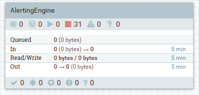
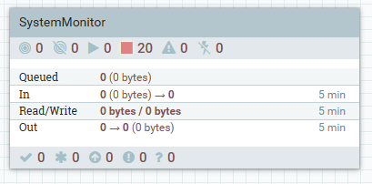
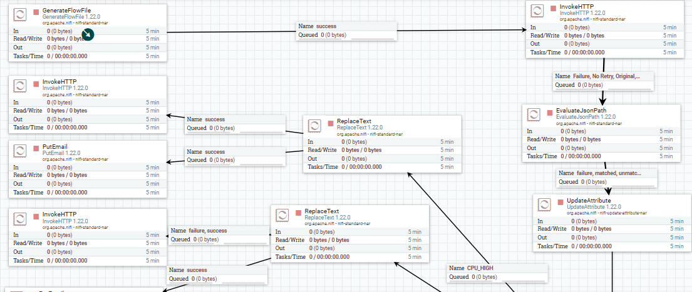
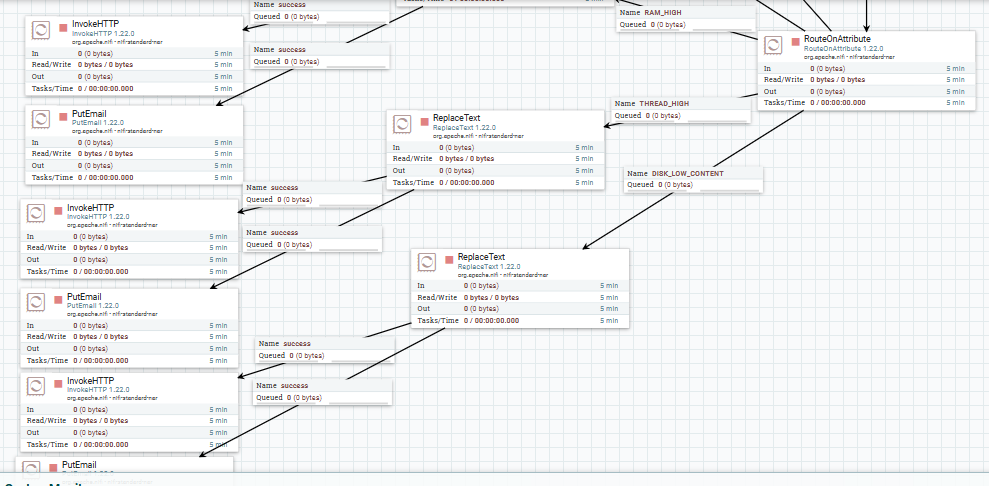
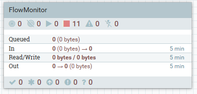
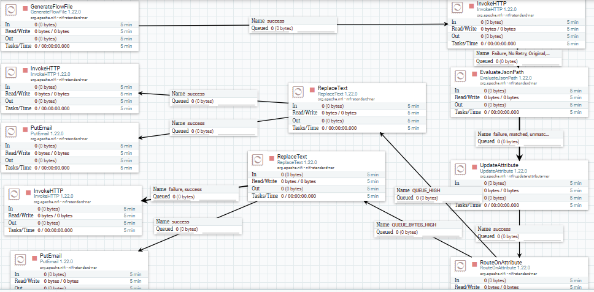
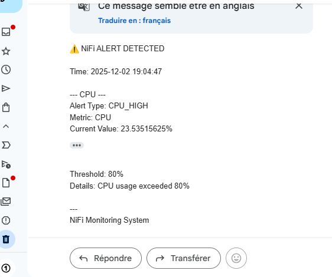
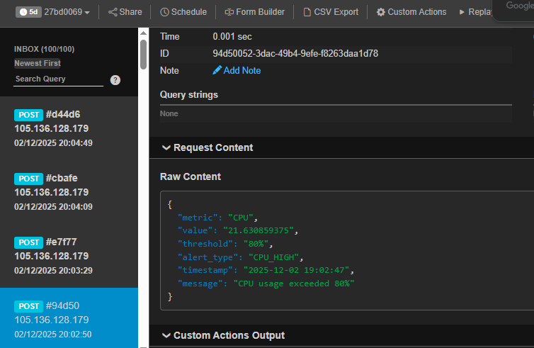

# Alerting workflow simulation through NiFi
## Main Alerting Process Group

## Metrics System Alerting – Sub Process Group

## Metrics Alerting System Flow 

## Queue Alerting – Sub Process Group 

## Queue Alerting Flow

## Email Alert Output

## URL Alert Output

