# Apache NiFi Alerting System
The flow continuously monitors system and NiFi metrics (CPU, RAM, Threads, Disk usage, etc.), evaluates them against predefined thresholds, and triggers alerts via HTTP and Email when anomalies are detected.

The alerting pipeline is built around the following logical stages:

- **Flow Triggering**
- **Metrics Collection** 
- **Metrics Extraction**
- **Threshold Evaluation** 
- **Routing** 
- **Notification**
  
## Main Alerting Process Group

## Metrics System Alerting – Sub Process Group

## Metrics Alerting System Flow 

## Processors Description
- **GenerateFlowFile**
  
Acts as a scheduler to trigger the monitoring flow periodically.
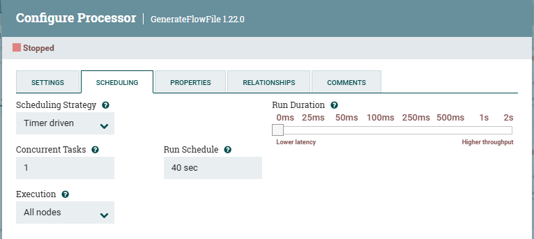
- **InvokeHTTP**
  
Metrics Collection
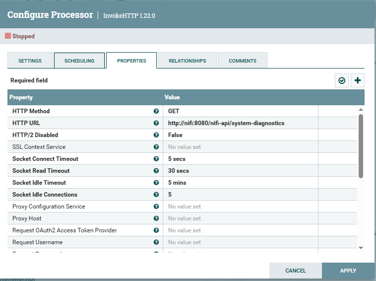

Calls a monitoring endpoint (NiFi API / system metrics API).

GET /nifi-api/system-diagnostics

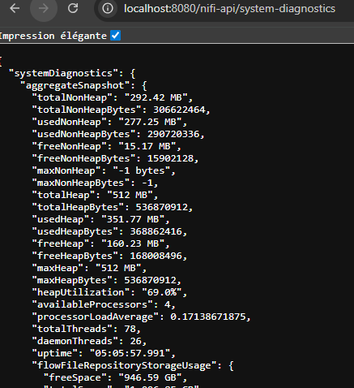
- **EvaluateJsonPath**
  
Extracts metrics from the JSON response.
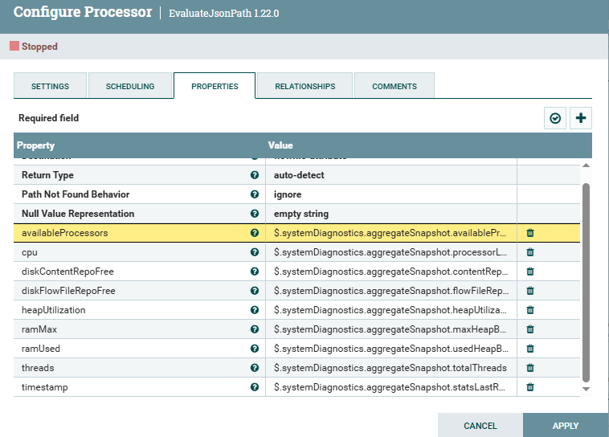
- **UpdateAttribute**
  
Normalizes metrics and defines the necessary attributes, such as metric thresholds for alerts.
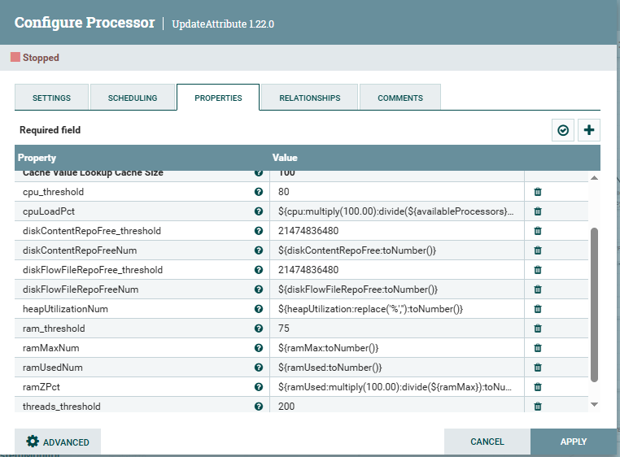
- **RouteOnAttribute**
  
Alert Detection : Compares metrics against thresholds and routes FlowFiles.
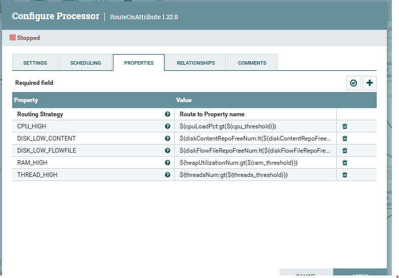
- **ReplaceText**
  
Alert Message Formatting : Builds a clean and readable alert message.
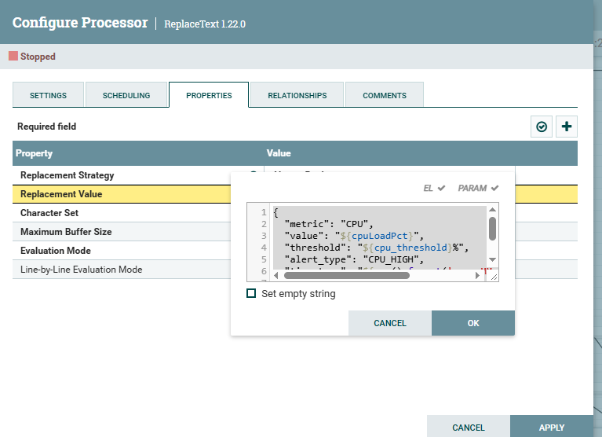
## Notification Processors
- **PutEmail**
  
Sends alert notifications via email.
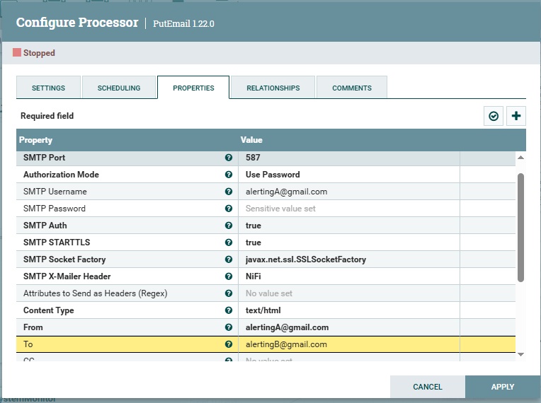
- **InvokeHTTP (Webhook / API)**
  
Sends alerts to external systems (Slack, Teams, Monitoring API, etc.).
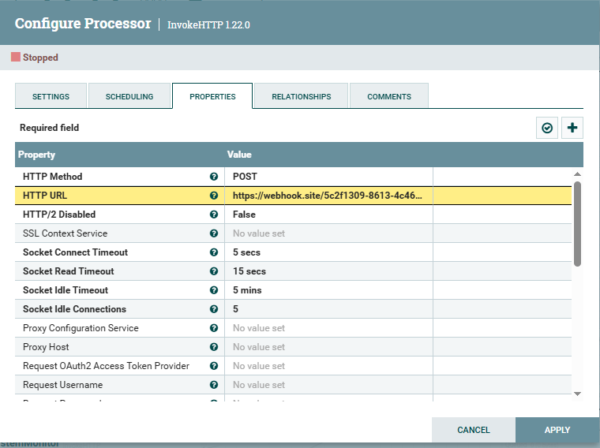

## Queue Alerting – Sub Process Group 

## Queue Alerting Flow

## Processors Description
In this sub-process group, we use the same processors; the only difference is the API endpoint used to extract different NiFi metrics.
- **InvokeHTTP**
  
Metrics Collection
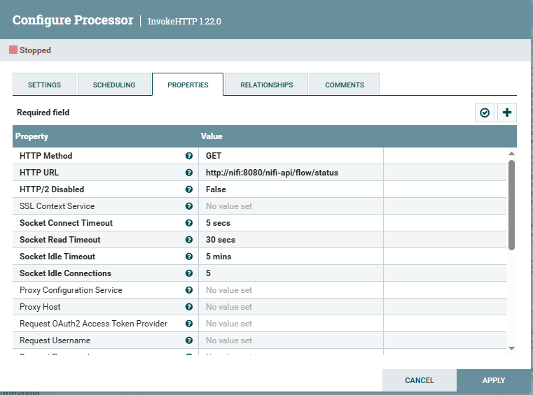

Calls a monitoring endpoint (NiFi API / system metrics API).

GET /nifi-api/flow/status

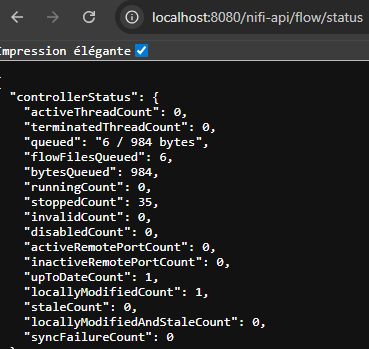
- **EvaluateJsonPath**
  
Extracts metrics from the JSON response.

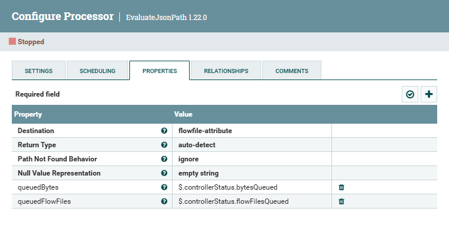

## Results
## Email Notification
- **CPU metric alert**
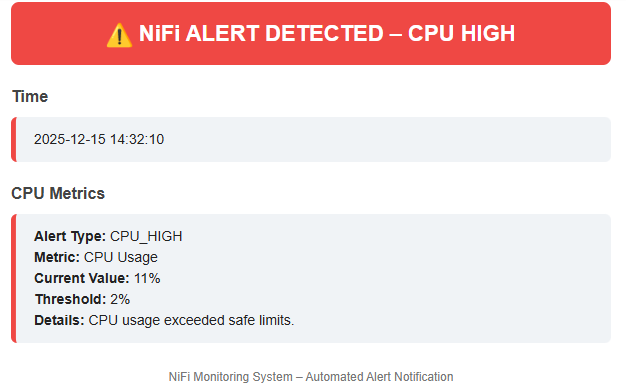
- **Threads metric alert**
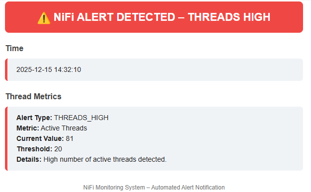
- **Que FlowFile metric alert**
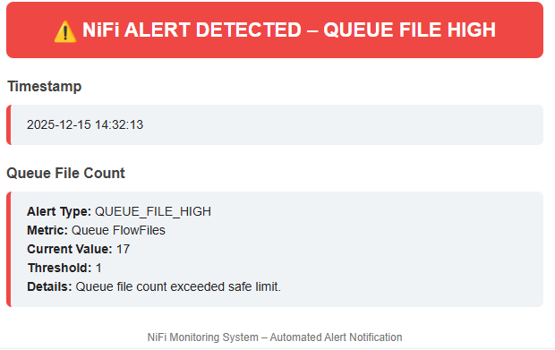

## Webhook / API Notification
- **CPU metric alert**
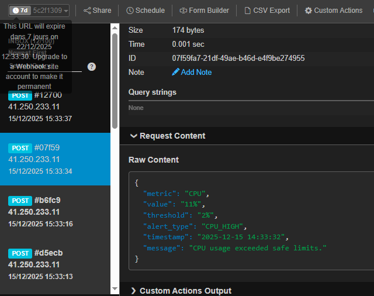
- **Threads metric alert**
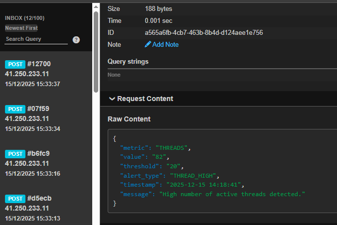
- **Que FlowFile metric alert**
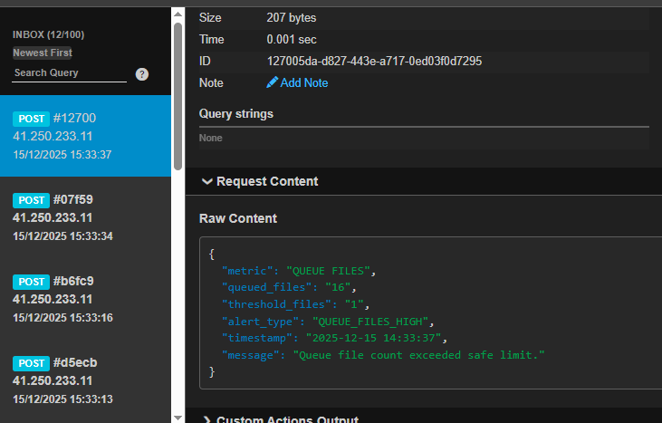

## Requirements
- Apache NiFi 1.22
- Access to metrics endpoint
- SMTP server (for email alerts)
- Optional webhook endpoint

