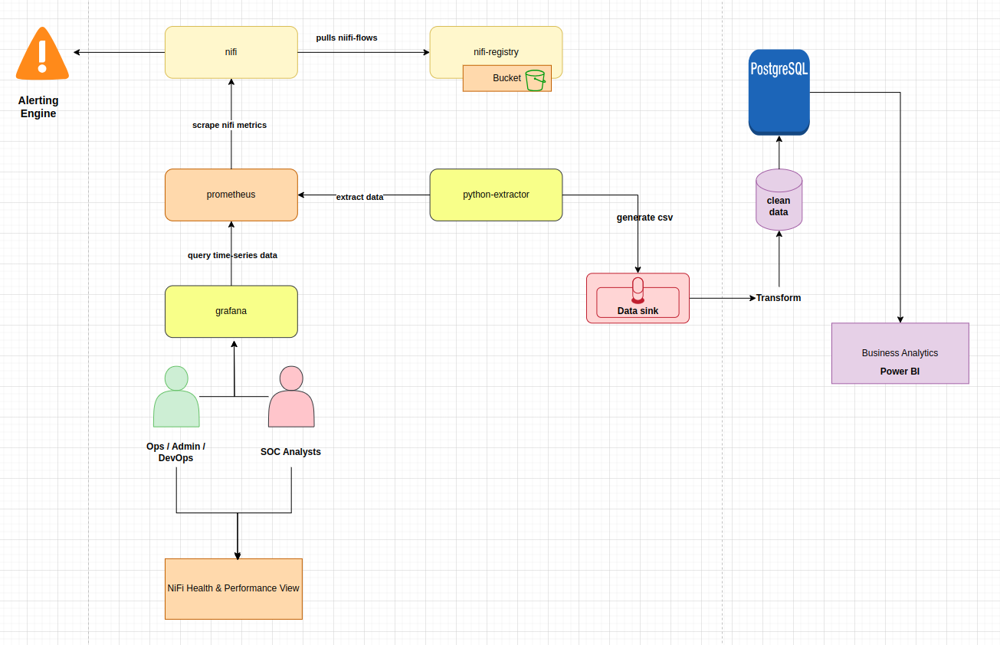

# NiFiPulse
We chose this name as we beleive it reflects the essence of our capstone project with ArkXJobInTech and DXC.
**NiFiPulse** is a lightweight on-prem monitoring and alerting solution for Apache NiFi clusters.  
It continuously tracks system and pipeline health: CPU, RAM, disk usage, file I/O, NiFi pipeline metrics, and more, then triggers alerts when thresholds are exceeded.

## Features

- **Metrics Collection** : Gather CPU, RAM, file system, and NiFi flow stats.  [nifi_flows](nifi_flows)
- **NiFi Integration** : Connects directly with NiFi APIs to pull processor and queue metrics.  
- **Alerting Engine** : Send email, Slack, or webhook alerts based on user-defined thresholds.  [Alerting](Alerting/Alerting.md)
- **Custom Dashboards** : Visualize health trends and performance over time.   [grafana](grafana/dashboards)
- **On-Prem Ready** : Designed for environments without external cloud dependencies.  [Docker](docker-compose.yml)
- **Secure Configuration** : Credentials and endpoints are managed via `.env` files.

## Use:
After running `docker compose up` run:
- Run SQL init inside the container : `docker exec -it postgres sh -c 'psql -U postgres -d postgres -f /docker-entrypoint-initdb.d/SQL_Script.sql'`
- Verify tables: 
  1. Ubuntu: `docker exec -it postgres sh -c 'psql -U postgres -d metrics_db -c "\dt"'`
  2. Windows: `docker exec -it postgres psql -U postgres -d metrics_db -c "\dt"`
- Run: `pip install -r requirements.txt`
- Run: `pip install -e .`
- Run ETL: `nifipulse --poll <number_of_polls_10_by_default_0_for_infinite>`
- Run quick sanity check:
1. **Ubuntu:**
--- 
    docker exec -it postgres sh -c 'psql -U postgres -d metrics_db -c "
    SELECT f.fact_id, d.timestamp_utc, i.instance_name, m.metric_name, c.component_name, f.value
    FROM fact_metrics f
    JOIN dim_date d      ON d.date_id = f.date_id
    JOIN dim_instance i  ON i.instance_id = f.instance_id
    JOIN dim_metric m    ON m.metric_id = f.metric_id
    JOIN dim_component c ON c.component_id = f.component_id
    ORDER BY d.timestamp_utc DESC
    LIMIT 20;"'
---

1. **Windows:**
---
    docker exec -it postgres psql -U postgres -d metrics_db -c "
    SELECT f.fact_id, d.timestamp_utc, i.instance_name, m.metric_name, c.component_name, f.value
    FROM fact_metrics f
    JOIN dim_date d      ON d.date_id = f.date_id
    JOIN dim_instance i  ON i.instance_id = f.instance_id
    JOIN dim_metric m    ON m.metric_id = f.metric_id
    JOIN dim_component c ON c.component_id = f.component_id
    ORDER BY d.timestamp_utc DESC
    LIMIT 20;"
---

## Architecture
 

## State of Art
- [State of Art FR](state_of_art/Etat_de_l_art.pdf)
- [State of Art Eng](state_of_art/State_of_art.pdf)

## Data Simulation
Nifi Registery config
- [Nifi Prometheus Registery config](simulation/nifi_prom_conf.md)

### Files:
-`docker exec -it nifi /bin/bash` + `ls -l /opt/nifi/nifi-current/data/outgoing` to list simulated data files from NiFi.
- [Similated file workflows](simulation/file_simulation.md)
- [Similated Pipeline (success/failure)](simulation/pipeline_simulation.md)

## Configuration files
- [docker set-up for Nifi and Prometheus](docker-compose.yml)
- [Prometheus job configuration file](prometheus.yml)
- [Grafana dashboards configuration](grafana/dashboards/dashboard.yml)
- [Grafana datasource configuration](grafana/dashboards/datasource.yml)

# For Collaborators
- run `git clone https://github.com/DXC-DP-Monitoring/NiFiPulse.git` on your local machine, on your preferred folder.
## Pull for updates
- run `git branch` to make sure you are on main , if not run `git checkout main`
- run `git pull origin main`, this will fetche updates from the remote repo (`origin`) and merges them into your local `main` branch
- To keep the history linear: `git fetch origin` + `git rebase origin\main` (no merge)

## License

This project is licensed under the Apache License 2.0. See the `LICENSE` file for the full license text.

Copyright (c) 2025 Amina BOUHAMRA, Fadwa EL AMRAOUI, Nawar TOUMI, Soukayna BOUCETTA