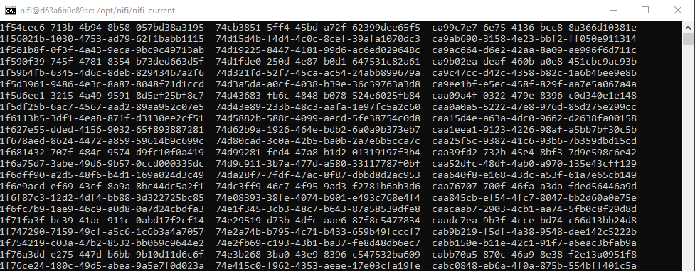
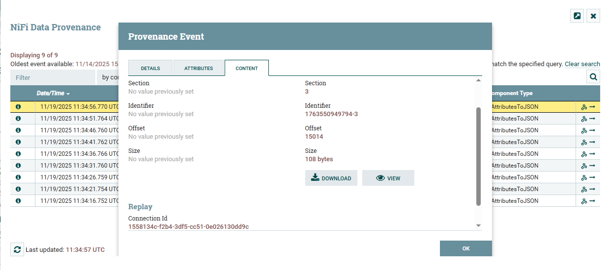
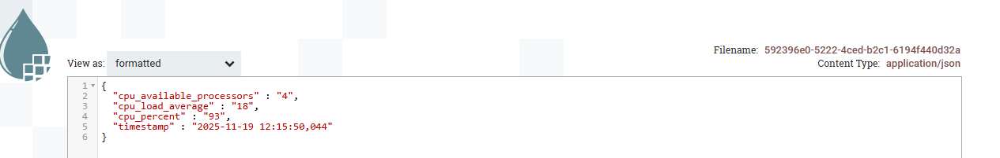
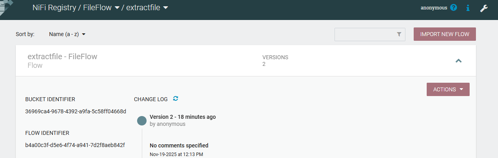
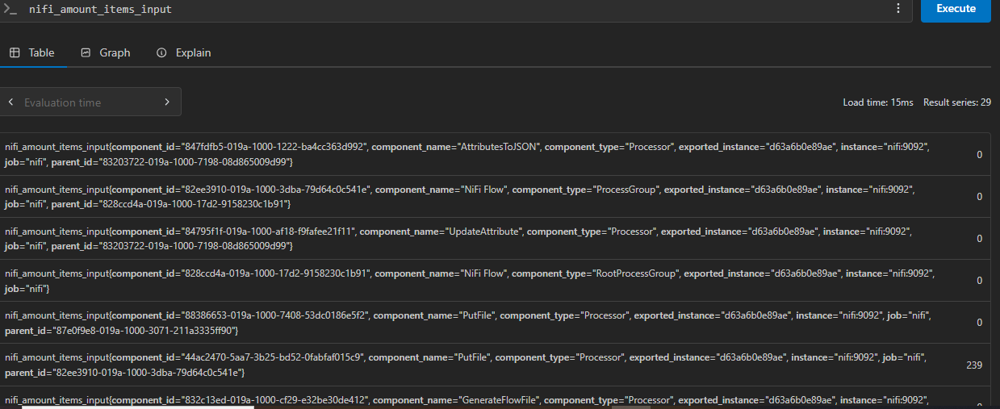

# CPU workflow simulation through Nifi 
## Simple CPU flow on Nifi UI 

## Nifi flow 

## Generated Cpu Metrics 

## NiFi Data Provenance 

## NiFi Data Provenance Output

## Nifi registery

## Query: nifi_amount_items_input metric

