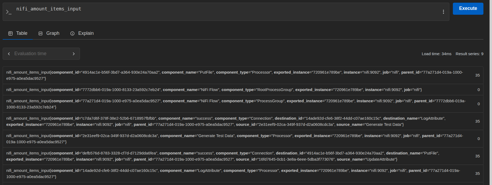

# File workflow simulation through Nifi API
## Simple file flow on Nifi UI

## Generated files

## Nifi flow from registery

## Prometheus Job from Nifi success

- Query: nifi_amount_items_input metric

## Output of extraction py script from prometheus
- Prometheus Metrics Log Csv File

- ExtractionPyScript output on shell (terminal)
