# File workflow simulation through Nifi API
## Simple file flow on Nifi UI
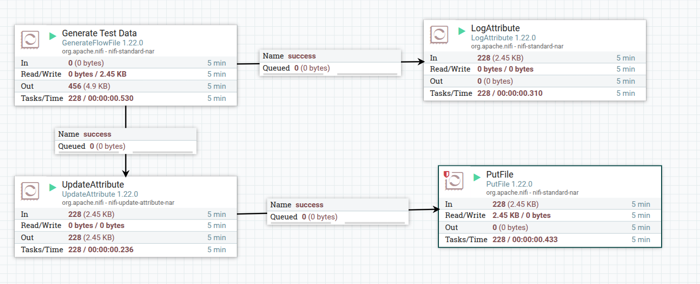
## Generated files
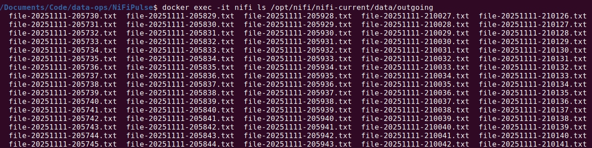
## Nifi flow from registery
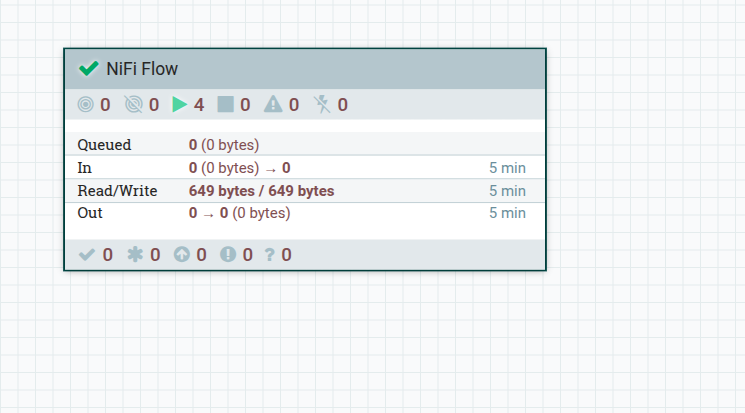
## Nifi registery
- (a bucket have to be created in order to use it)
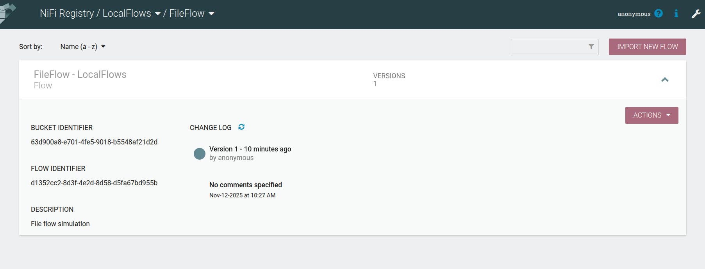
- Settings of registry
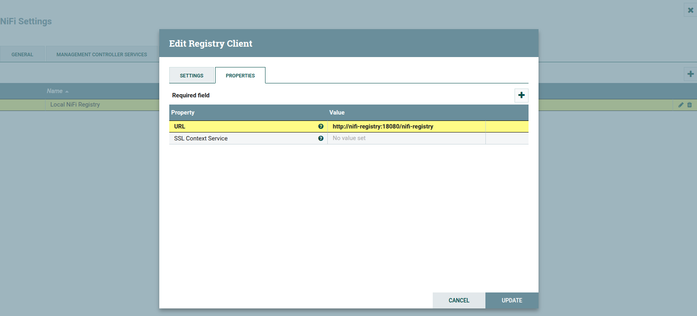
## Prometheus conf in Nifi
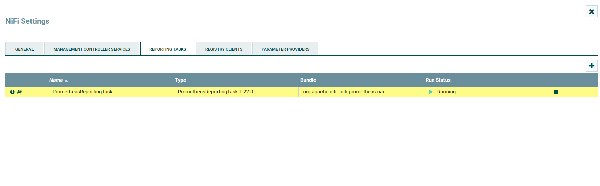
- Prometheus Settings In Nifi
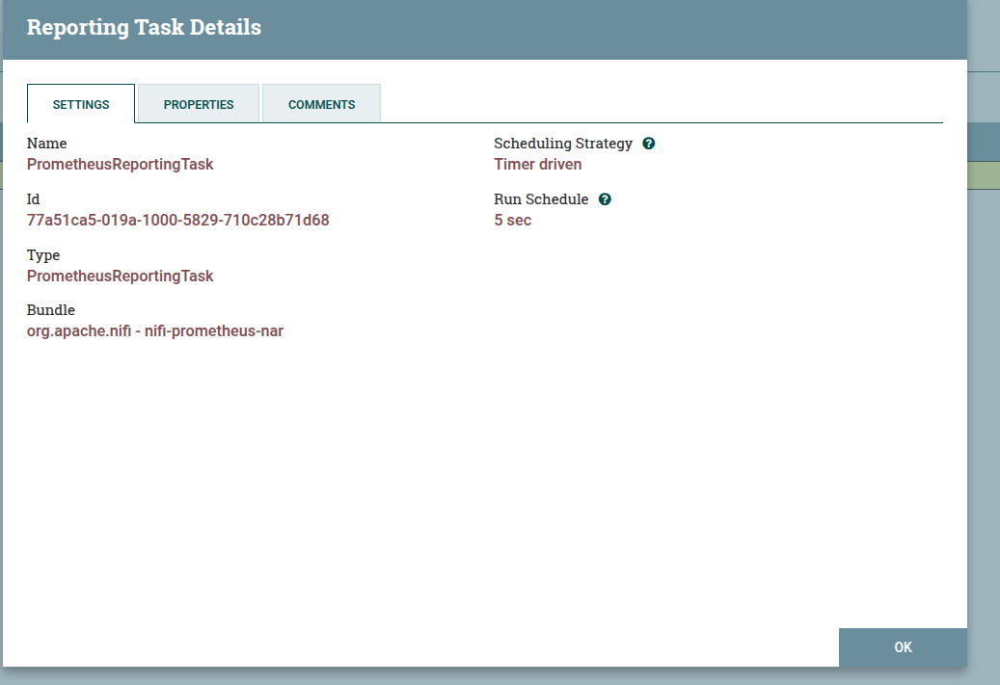
- Prometheus Properties In Nifi
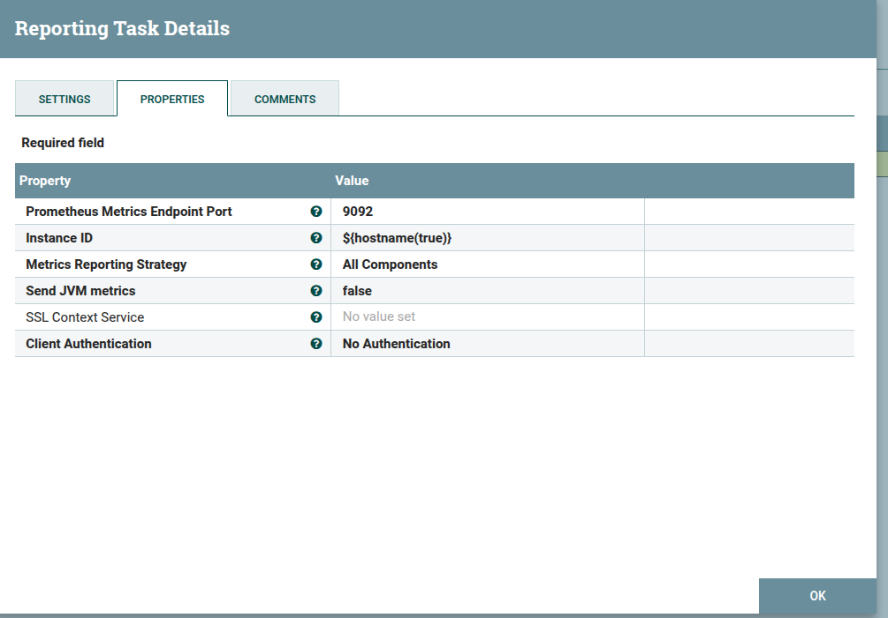
## Prometheus Job from Nifi success
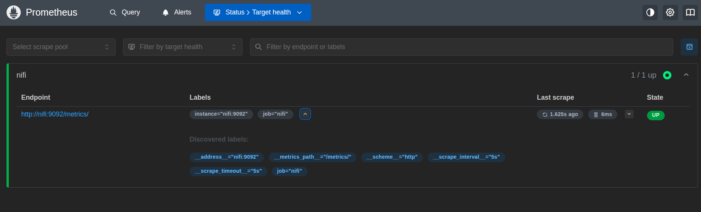
- Query: nifi_amount_items_input metric

## Output of extraction py script from prometheus
- Prometheus Metrics Log Csv File
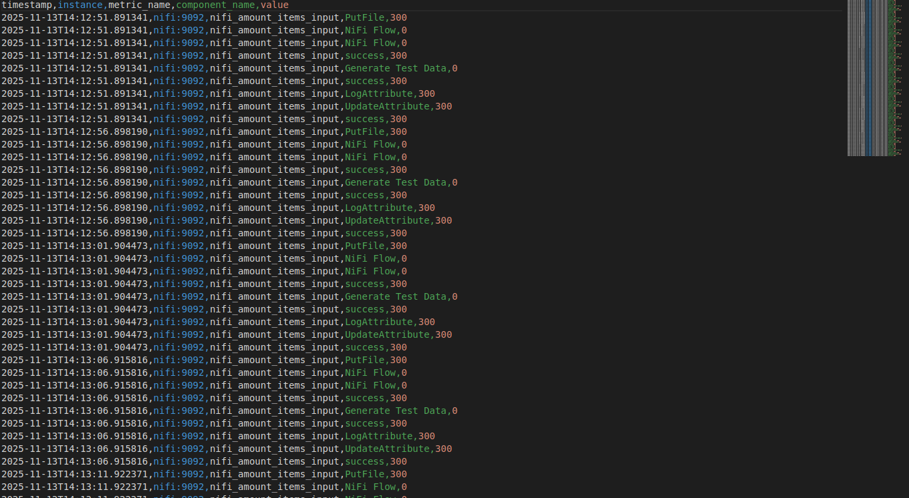
- ExtractionPyScript output on shell (terminal)
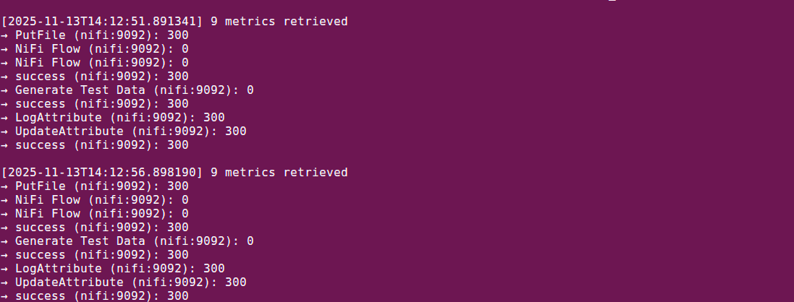